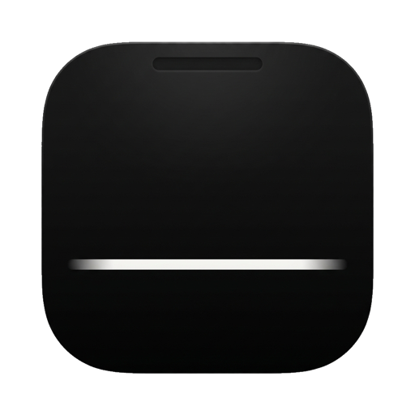

<p align="center">
  
</p>

<h1 align="center">Ledge</h1>

<p align="center">
  A native macOS utility that turns the notch into a calm, useful surface.
  <br>
  <strong>File Shelf &middot; Now Playing &middot; Timer &middot; World Clocks &middot; Bitcoin</strong>
</p>

<p align="center">
  <a href="https://github.com/satsdisco/ledge/releases/latest"></a>
  
  
  <a href="https://github.com/satsdisco/ledge/releases/latest"></a>
</p>

---

## What it does

Ledge lives invisibly inside your MacBook notch. Hover or press **⌃⌥Space** to expand a clean drawer with your active module. Right-click for quick actions. Close the drawer and it disappears — no Dock icon, no menu bar clutter.

## Modules

| Module | What it does |
|--------|-------------|
| **File Shelf** | Drag files onto the notch to park them temporarily. Drag out to any app, copy path, reveal in Finder, pin items across relaunches. |
| **Now Playing** | Album art, track title, artist, and transport controls for Apple Music and Spotify. |
| **Timer** | Focus presets (5 / 10 / 25 / 60 min), start / pause / reset, sounds on completion. |
| **World Clocks** | Up to 6 configurable timezones with analog or digital faces, live-updating. |
| **Bitcoin** | Live BTC/USD from CoinGecko — price, 24h change, and a sparkline chart. |

Each module can be enabled or disabled independently in Settings.

## Install

**[Download the latest DMG](https://github.com/satsdisco/ledge/releases/latest)** (macOS 14 Sonoma or later)

1. Open the DMG.
2. Drag **Ledge** to **Applications**.
3. Launch Ledge. Grant Automation permission when prompted (needed for Now Playing).
4. Enable "Launch at login" in Settings if you'd like.

Ledge is Developer ID signed and Apple notarized — no Gatekeeper warnings.

## Usage

| Action | How |
|--------|-----|
| Expand | Hover the notch, or press **⌃⌥Space** |
| Collapse | Move the cursor away, or press **⌃⌥Space** again |
| Switch modules | Click the tabs in the expanded header |
| Drop files | Drag any file onto the notch |
| Quick actions | Right-click the notch area |
| Open Settings | Right-click → Settings, or expand + ⌘, |
| Quit | Right-click → Quit Ledge |

The keyboard shortcut is customizable in Settings → Shortcuts.

## Build from source

Requires Xcode 16+ and macOS 14+.

```bash
git clone https://github.com/satsdisco/ledge.git
cd ledge
swift build
./scripts/make-app.sh
open build/Ledge.app
```

To build a signed release DMG:

```bash
./scripts/release.sh              # Developer ID signed
./scripts/release.sh --notarize   # + Apple notarized
```

## Architecture

Ledge is built with **Swift + SwiftUI** for content and **AppKit** (`NSPanel`) for the floating window layer. The module system uses a protocol-based architecture — each module is a self-contained unit with its own views, state, and persistence.

```
App/                 Entry point, AppDelegate, RootCoordinator
Window/              NSPanel, geometry, display coordination
Interaction/         Hover engine, expansion controller, keyboard shortcuts
ModuleHost/          Module protocol, registry, persistence, enable/disable
Modules/             FileShelf, NowPlaying, Timer, Clocks, Bitcoin
Services/            Logging, feature flags, login item
DesignSystem/        Motion tokens, palette, typography
Settings/            SwiftUI settings panes
```

See [`docs/ARCHITECTURE.md`](docs/ARCHITECTURE.md) for the full design, and [`docs/ADRs/`](docs/ADRs/) for key engineering decisions.

## Privacy

Ledge is local-first. The only network calls are:

- **CoinGecko API** — public price data for the Bitcoin module (no auth, no tracking).
- **Sparkle** — (planned) checks for app updates.

No telemetry, no analytics, no accounts, no cloud sync. Your data stays on your Mac in `~/Library/Application Support/Ledge/`.

## Requirements

- macOS 14 Sonoma or later
- Apple silicon or Intel Mac (universal binary)
- A Mac with a notch (works on non-notch Macs with the synthetic-notch option in Settings → Advanced)

## License

All rights reserved. Free to download and use.

## Credits

Built by [@satsdisco](https://github.com/satsdisco).

Uses [KeyboardShortcuts](https://github.com/sindresorhus/KeyboardShortcuts) by Sindre Sorhus.
